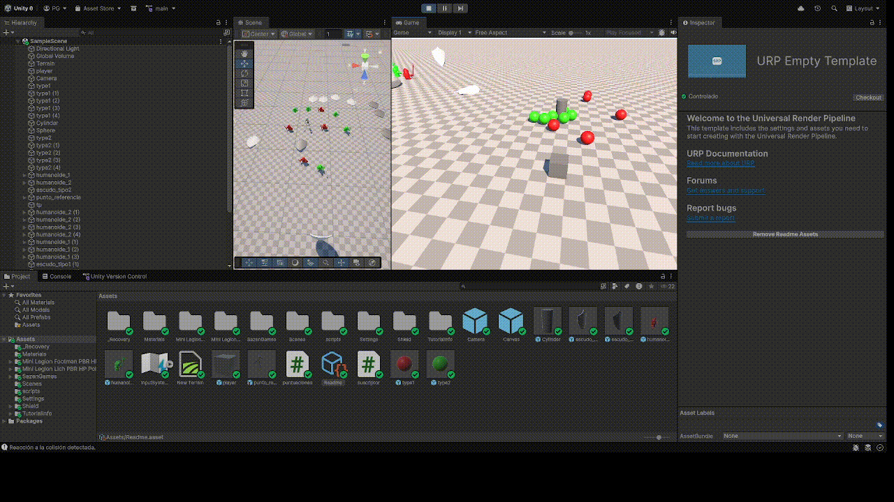
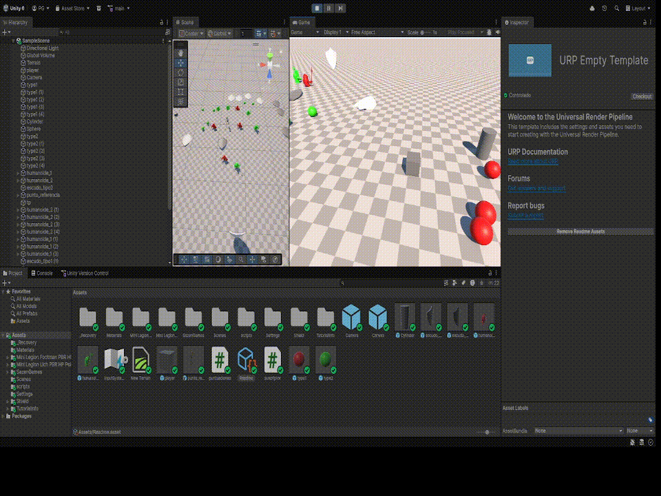

# interfaces_inteligentes_p04
## las esferas rojas siguen una verde, y las verdes siguen al cilindro.
Todo esto se activa al tocar el cilindro con el cubo

## Se ve como los soldados rojos van a sus escudos al tocar un soldado verde, y viceversa.
También se aprecia el cambio de color de los escudos al ser tocados por los soldados

## Se puede ver como el esqueleto actua como punto de referencia

## arriba a la izquierda aparece en la UI la puntuación del jugador

